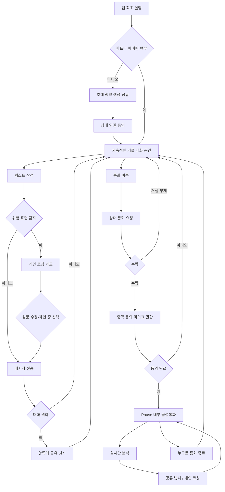

# 화면 플로우 — Pause (가명)

작성일: 2026-07-17
버전: v0.2
근거 문서: `02-prd.md`, `03-tech-spec.md`, `04-mvp-feature-spec.md`

## 1. 전체 플로우

## 2. 화면 목록

| 화면 | 핵심 요소 |
|---|---|
| 최초 페어링 | 초대 링크 생성·공유, 상대 연결 동의, 오류·만료 안내 |
| 커플 대화 공간 | 메시지 목록, 텍스트 입력창, 통화 버튼, 연결·안전 상태 |
| 개인 코칭 카드 | 작성자에게만 표시, 원문 전송·수정·제안·닫기 |
| 통화 요청 | 수락·거절, 상대 부재·요청 취소 상태 |
| 통화 동의·권한 | 분석 범위, 원본 음성 비저장, 마이크 권한 |
| 통화 중 | 마이크·연결 상태, 공유 넛지, 개인 코칭, 종료 |
| 재연결·안전 안내 | 연결 끊김, 분석 중단, 신고·차단·전문기관 안내 |

## 3. 핵심 상호작용 원칙

- 사용자는 통화 모드·텍스트 모드를 사전에 선택하지 않는다. 같은 대화 공간에 둘 다 있다.
- 개인 코칭은 절대 상대에게 공개하지 않는다.
- 공유 넛지는 양쪽에 같은 중립 문구로 표시한다.
- 메시지 전송과 통화 종료를 자동으로 막지 않는다.
- 통화 종료 즉시 마이크와 분석이 중단되었음을 표시한다.
- v1에서는 통화 요약·감정 온도 그래프·세션 저장 선택 화면을 제공하지 않는다.

## 4. 예외 플로우

- 초대 링크 만료·중복 사용: 새 링크 생성 안내
- 통화 요청 거절·부재: 대화 공간으로 복귀
- 마이크 권한 거절: 통화 연결 없이 권한 안내
- 네트워크 끊김: 연결 상태·재연결 버튼 표시, 분석 중단 명시
- 위험 신호: 일반 넛지 대신 안전 안내와 전문기관 연결로 분기
- 신고·차단: 대화 접근을 제한하고 안전 관련 안내 표시

## 5. 개발 전 결정사항

1. 텍스트 메시지 보존·삭제 기간
2. 통화 중 화면을 보지 않을 때 넛지 전달 방식
3. 관계 위협 표현의 개입 기준
4. 통화 강제 종료 시도의 처리 기준
5. AI 분석을 끈 상태에서 기본 통화·텍스트를 허용할지
6. 초기 웹 프로토타입의 통화 요청 전달 방식
7. 지역별 안전기관 안내 콘텐츠
