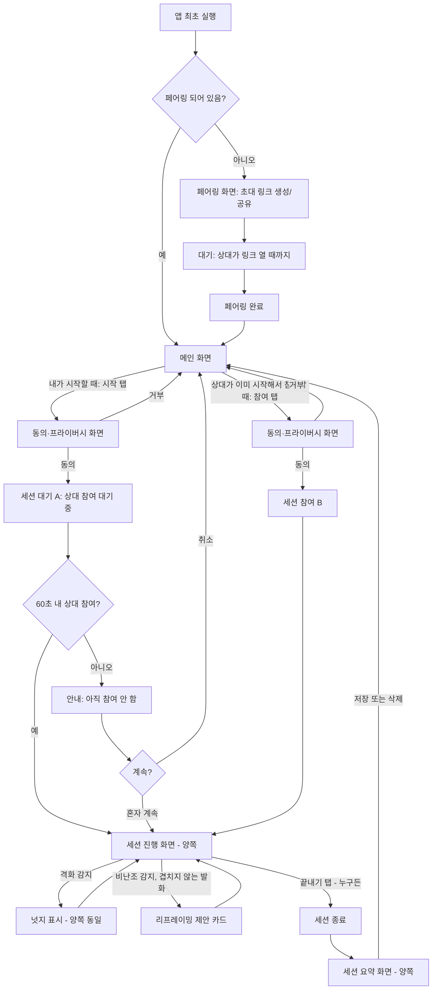

# 화면 플로우 — Pause (가명)

작성일: 2026-07-15
버전: v0.1
근거 문서: `02-prd.md`, `03-tech-spec.md`, `04-mvp-feature-spec.md` (두 기기 구조 반영)

목적: MVP 기능 정의(04)에 나온 6개 화면을 실제 화면 전환 흐름으로 연결. 코드 작업 착수 전 화면 단위로 최종 확인.

---

## 1. 전체 플로우 다이어그램

## 2. 화면별 상세

### 2.0 페어링 화면 (최초 1회만, 이후 재방문 없음)

| 요소 | 내용 |
|---|---|
| 진입 조건 | 페어링된 상대가 없는 상태로 앱 최초 실행 |
| 주요 요소 | "파트너 초대하기" 버튼 → 탭 시 링크 생성 및 공유 시트(카톡/문자 등 OS 공유 기능) 오픈 |
| 대기 상태 | "상대가 아직 링크를 열지 않았어요" + 링크 재복사 옵션 |
| 완료 전환 | 상대가 링크 클릭 → 자동으로 메인 화면으로 전환 (양쪽 모두) |
| 참고 | 이 화면은 평생 한 번만 보임. 재페어링(기기 변경 등)은 별도 "설정" 메뉴로 분리 (MVP 범위 밖, 추후 정의) |

### 2.1 메인 화면

| 요소 | 내용 |
|---|---|
| 상시 표시 | "OO님과 연결됨" (페어링 상태 확인용, 최소 정보) |
| 핵심 액션 | 버튼 하나 — 진행 중인 세션이 없으면 "시작", 상대가 이미 세션을 시작해놓았으면 자동으로 "참여"로 바뀜 |
| 디자인 원칙 | 화면에 이 버튼 외 다른 선택지가 없어야 함 (PRD 4-1절 기준 문장 적용) |
| 진입 경로 | 페어링 완료 후, 세션 종료 후 요약 화면에서 돌아올 때 |

### 2.2 동의·프라이버시 화면

| 요소 | 내용 |
|---|---|
| 진입 조건 | "시작" 또는 "참여" 탭 직후, 마이크 활성화 전 |
| 표시 문구 | "이 세션은 마이크로 대화를 듣고 분석합니다. 원본 음성은 저장하지 않습니다" (기술 스펙 6절 데이터 정책과 일치) |
| 액션 | 동의 / 거부 |
| 마찰 최소화 | 최초 1회 동의 후 "이 기기에서 다시 묻지 않기" 옵션 제공 (완전 제거는 아님 — 법적 요건상 최소 1회는 명시적 동의 필요) |
| 거부 시 | 메인 화면으로 복귀, 세션 시작되지 않음 |

### 2.3 세션 대기 (A 전용 상태) / 2.3-1 세션 참여 (B 전용 액션)

| 요소 | 내용 |
|---|---|
| A 화면 | "듣고 있음" 표시 + "상대 참여를 기다리는 중" 문구 |
| B 화면 | 메인 화면의 버튼이 "참여"로 표시되어 있어 탭만 하면 즉시 합류 |
| 타임아웃 | 60초 경과 시 A 화면에 "아직 참여하지 않았어요" + [혼자 계속하기] / [취소] 선택 |
| B 합류 완료 시 | 양쪽 화면이 동시에 세션 진행 화면(2.4)으로 전환 |

### 2.4 세션 진행 화면 (양쪽 동일 레이아웃)

| 요소 | 내용 |
|---|---|
| 상시 표시 | "듣고 있음" 인디케이터 (마이크 아이콘 + 애니메이션, 항상 눈에 보이는 위치) |
| 넛지 영역 | 격화 감지 시 화면 상단에 중립적 메시지 노출, 5~10초 후 자동 소멸 |
| 리프레이밍 카드 영역 | 비난조 발화 감지 시 카드로 노출, 사용자가 닫기 전까지 유지 (강제 아님, 참고용) |
| 종료 버튼 | 화면 하단 고정, 누구든 탭 가능 — 탭한 사람과 무관하게 양쪽 동시 종료 |
| 디자인 원칙 | 넛지·카드 모두 "누구를 지적하는" 톤이 아니라 "우리 둘"을 향한 톤으로 문구 작성 (PRD 8절) |

### 2.5 세션 요약 화면 (양쪽 동일)

| 요소 | 내용 |
|---|---|
| 표시 내용 | 감정 온도(격화 스코어) 그래프, 세션 중 노출됐던 리프레이밍 제안 목록 |
| 액션 | "저장" / "삭제" 중 택1 (기본 선택값은 삭제) |
| 추가 입력 없음 | 기분 평가, 퀴즈 등 요구하지 않음 (PRD 4-1절, 04문서 2.8) |
| 다음 전환 | 선택 후 메인 화면(2.1)으로 복귀 |

## 3. 화면 수 요약

- 신규 사용자: 페어링(1) → 메인(1) → 동의(1) → 세션 대기/참여(1) → 세션 진행(1) → 요약(1) = **최초 1회 한정 6개 화면**
- 재사용자(페어링 완료 후): 메인 → 동의 → 세션 대기/참여 → 세션 진행 → 요약 = **매번 5개 화면만 순환**

## 4. 오픈 이슈 (04문서 6절과 연결)

1. B에게 "A가 시작했다"는 걸 어떻게 알릴지 — 현재는 "말로 알림" 전제. 화면에 짧은 알림 배너라도 필요한지 결정 필요 (04문서 오픈 이슈 6번)
2. 메인 화면의 버튼이 "시작 ↔ 참여"로 자동 전환되는 로직의 구체적 판단 기준(서버가 세션 존재 여부를 어떻게 실시간으로 알려줄지) — 기술 스펙 2절 WebSocket Room 로직과 연결해서 확정 필요
3. 동의 화면의 "다시 묻지 않기" 옵션이 법적으로 매 세션 동의 요건을 충족하는지 — 법률 검토 필요 항목으로 별도 등록
